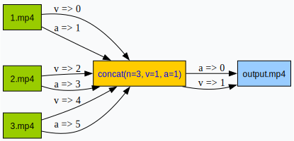

# FFmpeg Command Visualizer: Interactive Graph Generator for Complex Commands

[](https://ffmpeg-graph.site) 


Unlock the hidden structure of FFmpeg commands with our web-based visualization engine, designed for developers, video engineers, and multimedia educators. This tool transforms complex command-line syntax into interactive flow diagrams.

## Key Features
**🔄 Full FFmpeg Syntax Support**
- Visualizes `filter_complex` chains, stream mapping, and multi-input workflows
- Supports concat demuxer, overlay filters, and 200+ FFmpeg operations

**🔍 Real-Time Error Detection**
- Highlights syntax errors & invalid parameters
- Identifies common mistakes in stream connections

**📊 Interactive Learning Aid**
- Click any filter node to access official FFmpeg documentation
- Understand processing pipelines through zoomable diagrams

**🌐 Zero-Installation Web Tool**
- Works directly in modern browsers
- No FFmpeg/local dependencies required

## Quick Start
1. Visit [ffmpeg-graph.site](https://ffmpeg-graph.site)
2. Paste your FFmpeg command
3. Get instant visualization of:
   - Filter chain connections
   - Stream mapping relationships
   - Input/output pipeline structure

Example visualization of concat workflow:  

```sh
ffmpeg -i 1.mp4 -i 2.mp4 -i 3.mp4 -filter_complex "[0:v][0:a][1:v][1:a][2:v][2:a]concat=n=3:v=1:a=1[vout][aout]" -map "[vout]" -map "[aout]" output.mp4
```




## Supported Scenarios
| Use Case | Visualization Example |
|----------|-----------------------|
| Multi-input concatenation | Shows source merging logic |
| Audio/video filter chains | Displays processing order |
| Stream mapping | Visualizes track routing |
| Hardware acceleration | Highlights GPU pipeline |

## FAQs

### Command Analysis
**Q: What FFmpeg features does this tool support visualizing?**  
A: Full support for standard operations including filter chains, concat demuxer, and stream mapping.

**Q: How accurate is the generated diagram?**  
A: Diagrams match FFmpeg's actual execution pipeline using official syntax rules.

### Error Handling
**Q: Does this tool help identify command errors?**  
A: Yes! Real-time validation for syntax errors and parameter issues.

### Learning Resources
**Q: How does this help learn FFmpeg?**  
A: Interactive diagrams reveal: 
1. Filter chain connections 
2. Stream mapping logic
3. Command execution flow

## Contribute
Found a bug or have feature requests?  
➡️ [Open an Issue](https://github.com/jerryjee120/ffmpeg-graph/issues)  

---

: FFmpeg architecture overview (FFmpeg official documentation)
: FFmpeg Batch AV Converter visualization concepts
: FFmpeg GUI tool design patterns
: Multimedia processing workflows
: Error handling best practices
: Environment configuration solutions
